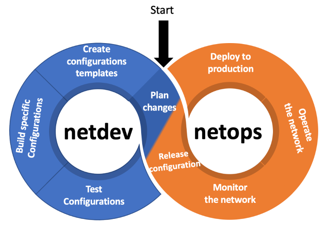

# NetDevOps

<figure markdown>
  
  <figcaption>NetDevOps Pipeline</figcaption>
</figure>

DevOps is a set of practices and tools that aim to improve collaboration and communication between development and operations teams in order to increase the speed and quality of software delivery. In the context of network operations, DevOps practices can be applied to the management and automation of network infrastructure in order to improve the speed and reliability of network changes, as well as reduce the risk of errors and downtime.

One key aspect of DevOps in network context is the use of automation and scripting to manage network devices and configurations. This can include using tools such as Ansible, Puppet, or Chef to automate the configuration of network devices, as well as using version control systems such as Git to manage and track changes to network configurations.

**CI/CD** - Another important aspect of DevOps in network context is the use of continuous integration and continuous delivery (CI/CD) to manage the deployment and testing of network changes. This can include using automated testing and validation tools to ensure that changes to the network are safe and functional before they are deployed to production. Additionally, it also includes monitoring and metrics tools to track the performance and availability of the network.

**Cultural Shift** - In addition to these technical practices, DevOps in network context also involves a cultural shift towards a more collaborative and cross-functional approach to network operations. This can include breaking down silos between different teams such as network engineers, developers, and system administrators, and fostering a culture of transparency, communication, and continuous improvement.

Overall, the goal of DevOps in network context is to improve the speed, reliability, and security of network operations, while reducing the risk of errors and downtime. By applying DevOps practices and tools to network management, organizations can improve the efficiency and effectiveness of their network operations and deliver better network services to their customers.